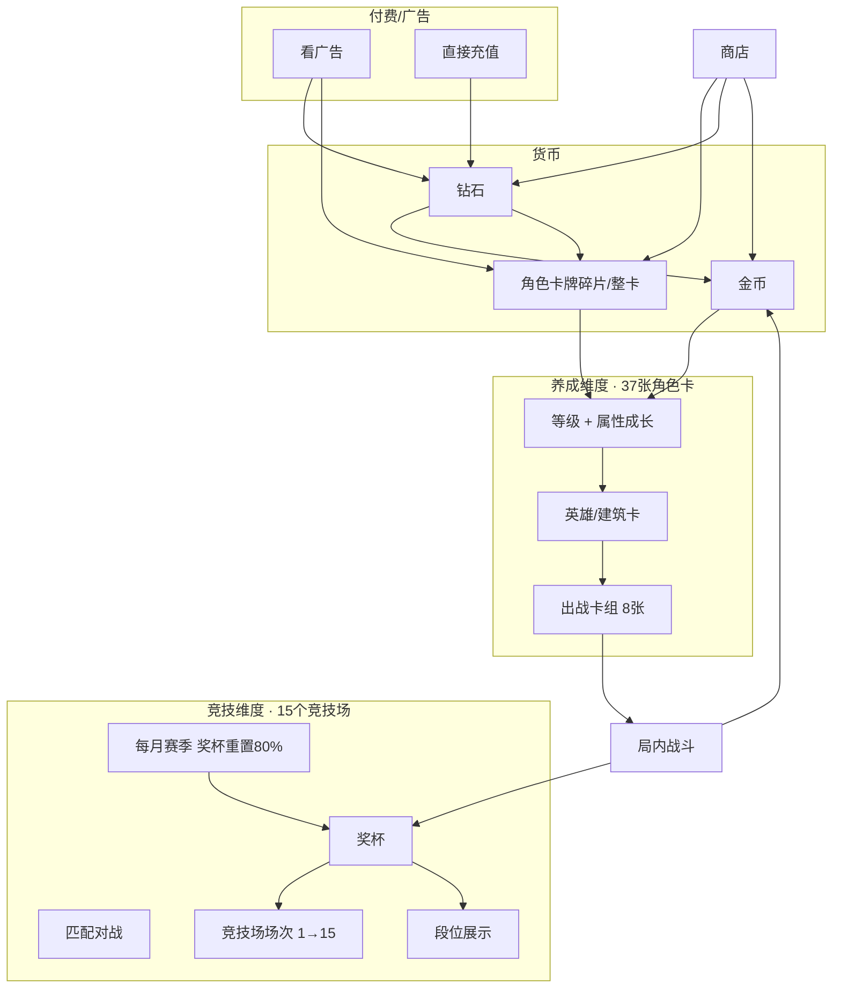

# 《代号x》系统大框架

> 把「养成」和「竞技」两条主线理清，以及它们如何挂钩。  
> 配表落地：`heroes-config.js`（HTML Demo）、`codename-x/assets/scripts/config/`（Cocos）。

---

## 一、总览：两个维度 + 一条经济链



**一句话**：战斗赚金币和奖杯 → 金币+卡牌养角色 → 更强卡组再打更高竞技场；钻石/广告从商店补卡牌和金币。

---

## 二、维度 A：角色卡牌养成（37 张）

### 2.1 卡牌池

| 项 | 说明 |
|----|------|
| 总量 | **37 张**（英雄 + 建筑 + 资源，如采矿机） |
| 品质 | 普通(绿) / 稀有(蓝) / 史诗(紫) / 传奇(金) |
| 配表 | [`heroes-config.js`](../heroes-config.js) |
| 出战 | 每场战斗携带 **8 张**（HTML Demo 已做卡组页） |

每张卡有 **1 级初始数值**（战力、攻击、单位血量、攻速等），通过升级提升张力。

### 2.2 单卡成长

```
角色升级 = 消耗「金币」+「该角色卡牌（碎片/整卡）」
         → 等级 +1
         → 攻击、血量、攻速等按配表成长
```

| 属性示例 | 1级来源 | 升级后 |
|----------|---------|--------|
| 攻击力 `attack` | `heroes-config` 初始值 | 每级 +X（待配 `heroLevel.json`） |
| 单位血量 `unitHp` | 同上 | 每级 +X |
| 攻击速度 `attackSpeed` | 1级较慢，上限 **10** | 随等级提升，极快=10 |
| 建筑血量 `buildingHp` | 建筑/箭塔类 | 随等级提升 |

### 2.3 卡牌 / 金币 / 钻石 从哪来

| 资源 | 主要来源 | 次要来源 |
|------|----------|----------|
| **金币** | 局内战斗（翻牌产金、胜利结算） | 钻石兑换、宝箱、任务 |
| **角色卡牌** | 商店礼包（四阵营·广告转盘） | 看广告领包、活动、宝箱 |
| **钻石** | 看广告 | 竞技场奖励、每日优惠广告位等（IAP 未接入） |

### 2.4 对应模块（Cocos）

| 功能 | Tab/模块 | Service |
|------|----------|---------|
| 卡组编辑、升级 | 卡牌 Tab | `ICardService` |
| 买卡包、货币 | 商店 Tab | `IShopService` |
| 局内翻牌战斗 | 战斗 → Battle 场景 | `IBattleService` + 战斗规则层 |
| 存档 | 全局 | `ISaveService` |

### 2.5 与当前 Demo 的对应

| 已有 | 待接 |
|------|------|
| `index.html` 8 槽卡组 | 升级 UI、碎片数量 |
| `heroes-config.js` 37 张 1 级数值 | `heroLevel.json` 成长曲线 |
| `battle.html` 翻牌 + 自动战斗 | 用真实卡组驱动翻出牌池 |

---

## 三、维度 B：战斗竞技场 + 段位（15 档）

### 3.1 两个概念别混

| 概念 | 是什么 | 玩家感知 |
|------|--------|----------|
| **竞技场（15 场次）** | 按奖杯解锁的对战档位 | 大厅岛屿、今日收益上限、宝箱品质 |
| **段位（15 档）** | 同一套奖杯区间下的荣誉等级 | 个人中心、战旗、排行榜展示 |

当前设计：**15 个竞技场与 15 个段位一一对应**，共用同一套奖杯区间（见下表）。

### 3.2 奖杯怎么涨

```
匹配 → 局内对战 → 胜利 +奖杯 / 失败 少加或不加
              → 同时 +金币（养成用）
```

- 奖杯 **只增不减**（正常对局，赛季结算除外）
- 奖杯达到下一段位下限 → **自动进入下一竞技场**

### 3.3 15 档段位 / 竞技场（奖杯区间）

| 场次 | 段位 | 奖杯区间 |
|------|------|----------|
| 1 | 青铜 | 0 ～ 29 |
| 2 | 白银 | 30 ～ 99 |
| 3 | 黄金 1 | 100 ～ 199 |
| 4 | 黄金 2 | 200 ～ 399 |
| 5 | 黄金 3 | 400 ～ 799 |
| 6 | 钻石 1 | 800 ～ 1,399 |
| 7 | 钻石 2 | 1,400 ～ 1,999 |
| 8 | 钻石 3 | 2,000 ～ 2,799 |
| 9 | 大师 1 | 2,800 ～ 4,999 |
| 10 | 大师 2 | 5,000 ～ 7,999 |
| 11 | 大师 3 | 8,000 ～ 11,999 |
| 12 | 王者 1 | 12,000 ～ 19,999 |
| 13 | 王者 2 | 20,000 ～ 39,999 |
| 14 | 王者 3 | 40,000 ～ 64,999 |
| 15 | 传奇 | 65,000 ～ ∞ |

配表代码：[`codename-x/assets/scripts/config/LobbyConfig.ts`](../codename-x/assets/scripts/config/LobbyConfig.ts)

### 3.4 赛季机制

| 规则 | 说明 |
|------|------|
| 周期 | **每月**一赛季 |
| 结算 | 赛季结束时奖杯 **重置 80%**（保留 20%，即 `新奖杯 = floor(旧奖杯 × 0.2)`） |
| 目的 | 拉大长期追求；高段玩家每月重新爬升 |
| 待定 | 赛季奖励、传奇保护线等（后续策划补） |

### 3.5 对应模块（Cocos）

| 功能 | 位置 | 说明 |
|------|------|------|
| 当前竞技场/奖杯 | 战斗 Tab 大厅 | `LobbyPage` 岛屿 + 进度 |
| 15 场列表 | 竞技场详情弹窗 | `ArenaDetailPopup` |
| 对战结算 | Battle → Lobby | `IBattleService.finishBattle` → 奖杯/金币/宝箱 |
| 段位名展示 | TopBar / 个人中心 | `getTierByTrophy(trophy)` |

---

## 四、两条线怎么在一场对局里汇合

```
┌─────────────────────────────────────────────────────────┐
│  战前：卡组 Tab 选 8 张 → 角色等级决定局内属性              │
│  竞技：当前奖杯决定匹配档位 + 今日收益上限                  │
└─────────────────────────────────────────────────────────┘
                            ↓
┌─────────────────────────────────────────────────────────┐
│  局内：翻牌 / 产金 / 英雄自动战斗 / 打主城或比击杀          │
│  （HTML Demo：battle.html + battle-rules.js）            │
└─────────────────────────────────────────────────────────┘
                            ↓
┌─────────────────────────────────────────────────────────┐
│  战后结算                                                │
│  · 胜利 → +奖杯 → 可能升竞技场/段位                       │
│  · +金币 → 回卡牌 Tab 升级角色                            │
│  · 可能掉宝箱 → 开宝箱得卡/资源                           │
└─────────────────────────────────────────────────────────┘
                            ↓
┌─────────────────────────────────────────────────────────┐
│  币不够 → 商店：广告/充值 → 钻石 → 金币或卡包              │
└─────────────────────────────────────────────────────────┘
```

---

## 五、工程文件地图（避免乱）

```
testgame/
├── docs/
│   ├── SYSTEM_FRAMEWORK.md      ← 本文（总框架）
│   └── AI_COCOS_FRAMEWORK_SPEC.md ← Cocos 实施细节
│
├── heroes-config.js             ← 37 张卡 1 级数值（养成维度的「静态配表」）
├── index.html / deck.js         ← 卡组 8 槽（养成 → 战前）
├── battle.html / battle-rules.js ← 局内战斗 Demo（竞技维度的「玩法验证」）
│
└── codename-x/                  ← 正式客户端
    ├── assets/scripts/config/LobbyConfig.ts   ← 15 竞技场 + 15 段位
    ├── modules/lobby/           ← 战斗一级页、匹配、结算入口
    ├── modules/card/            ← 卡牌养成（待扩升级）
    ├── modules/shop/            ← 商店、广告、充值 mock
    └── services/                ← IBattle / ICard / IShop / ILobby
```

---

## 六、建议开发顺序（减少乱）

1. **局内玩法稳定**（HTML Demo → Cocos Battle）— 进行中  
2. **37 卡配表进 `hero.json`**，与 `heroes-config.js` 对齐  
3. **卡组 8 槽 + 升级消耗**（金币 + 卡牌碎片）  
4. **战斗结算** → 金币 + 奖杯（已有 mock，改数值）  
5. **15 竞技场/段位**（已更新配表）→ 大厅展示  
6. **商店卡包** → 卡牌来源闭环  
7. **赛季重置** → 月底任务  

---

## 七、待策划细化的表（后续）

| 配表 | 内容 |
|------|------|
| `heroLevel.json` | 每卡每级攻击/血量/攻速成长 |
| `heroCardCost.json` | 升级所需碎片数、金币数 |
| `shopProducts.json` | 卡包价格（钻石/广告） |
| `battleReward.json` | 各竞技场胜利金币、奖杯增量 |
| `arena.json` | **已落地** 10 竞技场奖杯/经验/金币 |
| `accountLevel.json` | **已落地** 账号 1–100 级经验与奖励 |
| `chest.json` | **已落地** 7 档宝箱产出 |
| `heroLevel.json` | **已落地** 英雄升级碎片与分品质金币 |
| `docs/PROGRESSION_TABLES.md` | **可读汇总表**（上述配表 Markdown 版） |
| `season.json` | 赛季起止、重置比例、奖励 |
